<div align="center">
  <h1> NovelQA </h1>
  
  
  [](https://opensource.org/licenses/Apache-2.0)
  [](https://github.com/NovelQA/novelqa.github.io/issues)
</div>

# 📌 Table of Contents
- [📌 Table of Contents](#-table-of-contents)
- [🚀 Introduction](#-introduction)
- [📝 Dataset](#-dataset)
  - [Data Description](#data-description)
- [🏆 Evaluation \& Submission Procedure](#-evaluation--submission-procedure)
- [📜 License](#-license)
- [📚 Citation](#-citation)
- [📮 Contact](#-contact)
- [🎨 Website Template](#-website-template)
  
# 🚀 Introduction

  **NovelQA** is a benchmark to evaluate the long-text understanding and retrieval ability of LLMs. This dataset is constructed by manually collecting questions and answers about English novels that are above 50,000 words. Moreover, most of the questions are designed to focus on either minor details in the novel, or require information spanning multiple chapters, which are inherently challenging for LLMs. We welcome submissions with any LLM with long-context abilities!

  The rapid advancement of Large Language Models (LLMs) has introduced a new frontier in natural language processing, particularly in understanding and processing long-context information. However, the evaluation of these models' long-context abilities remains a challenge due to the limitations of current benchmarks. To address this gap, we introduce NovelQA, a benchmark specifically designed to test the capabilities of LLMs with extended texts. Constructed from English novels, NovelQA offers a unique blend of complexity, length, and narrative coherence, making it an ideal tool for assessing deep textual understanding in LLMs. 

  We create this [🏆 Leaderboard Website](https://novelqa.github.io/) to present the model's top scores on NovelQA. We encourage participants to refer to this leaderboard for your ranking.


# 📝 Dataset
  ## Data Description

  The dataset comprises two parts, the txt book and the json QA tuples. Each json file has a corresponding txt file with the same filename (as the novel title). 
  Each json file comprises a `list` of `dict`s, where a `dict` has a basic structure as follows.
```
[
    {
        "QID": the QID which remains unchanged for tracking updates (only happen if necessary),
        "Aspect": the question classification in 'aspect', e.g., "times",
        "Complexity": the question classification in complexity, e.g., "mh",
        "Question": the input question,
        "Options": {
            "A": Option A,
            "B": Option B,
            "C": Option C (not applicable in several yes/no questions),
            "D": Option D (not application in several yes/no questions)
        },
    },
    ...
]
```
  Here is an example of a real data point, selected from the demonstration file `Frankensstein`.
```json
[
    {
        "QID": "Q0148",
        "Aspect": "times",
        "Complex": "mh",
        "Question": "How many times has Robert written letters to his sister?",
        "Options": {
            "A": "11",
            "B": "9",
            "C": "12",
            "D": "10"
        },
    },
    ...
]
```
Currently we are only open-sourcing the fields above, without including the `Evidences` field in the case of answer leaking. However, individuals in need of the `Evidences` field for analysis can contact us (see [📮 Contact](#-contact)) to obtain it.

# 🏆 Evaluation & Submission Procedure

  Due to confidentiality considerations, the submission procedure is deployed through multiple steps on several platforms. An overview of the submission is shown in the following flowchart.

```mermaid
graph LR
    A[[🤗 Huggingface]]  --(Input Data)--> B[[🤖Your Model]]
    B --(Model output)--> C[[⚖️Codabench]]
    C --(Accuracy Score)--> D[[🗳️Google Form]]
    D ----> E[[🏆Leaderboard Website]]
```



  Our input data (including the novel, question, and options) is open-source on the [🤗 Huggingface](https://huggingface.co/datasets/NovelQA/NovelQA) platform. Participants who expect to evaluate their model are expected to download the data through Huggingface first. You may either execute the generative subtask with only the novel and quetion, or execute the multichoice subtask by inputting the novel, question, and options. Warning: The input data are only for internal evaluation use. Please do not publicly spread the input data online. The competition hosts are not responsible for any possible violation of novel copyright caused by the participants' spreading the input data publicly online.

  After inputting the data and obtaining the model output, you are expected to submit your model output to the [⚖️ Codabench](https://www.codabench.org/competitions/2727/#/participate-tab) platform for evaluation. Such a procedure is set for the purpose of preserving the confidentiality of the gold answers. The Codabench platform automatically runs evaluation on your result, and generates the accuracy score within an average of 5 minutes. If your submission fails or your evaluation is obviously above average, you may email us with the results to have us manually run the evaluation for you. For details about the Codabench platform and the evaluation procedure, see our instructions in our Codabench page.

  Your accuracy score is further expected to submit to us through the [🗳️ Google Form](https://docs.google.com/forms/d/e/1FAIpQLSdGneRm_Cna6sigDaugGEToVDjlAR0cogAI105fZa4dvILbnA/viewform?usp=sf_link) if you evaluate your results through Codabench to have us update it on our [🏆 Leaderboard](https://novelqa.github.io/). Our leaderboard presents the Top 7 models on the two subtasks separately.

# 📜 License

This dataset is released under the [Apache-2.0 License](LICENSE).

# 📚 Citation

If you use this dataset in your research, please cite it as follows:
```bibtex
@misc{wang2024novelqa,
      title={NovelQA: A Benchmark for Long-Range Novel Question Answering}, 
      author={Cunxiang Wang and Ruoxi Ning and Boqi Pan and Tonghui Wu and Qipeng Guo and Cheng Deng and Guangsheng Bao and Qian Wang and Yue Zhang},
      year={2024},
      eprint={2403.12766},
      archivePrefix={arXiv},
      primaryClass={cs.CL}
}
```
# 📮 Contact

If you have any questions or feedback, please feel free to reach out wangcunxiang@westlake.edu.cn or ruoxining@outlook.com. 

We welcome suggestions and contributions in any aspects to improve this dataset. 


# 🎨 Website Template

This leaderboard adopts the style of [bird-bench](https://github.com/bird-bench/bird-bench.github.io).