<div align="center">
  <h1> NovelQA </h1>
  
  
  [](https://opensource.org/licenses/Apache-2.0)
  [](https://github.com/NovelQA/novelqa.github.io/issues)
</div>

# 📌 Table of Contents
- [📌 Table of Contents](#-table-of-contents)
- [🚀 Introduction](#-introduction)
- [📝 Dataset](#-dataset)
  - [Data Description](#data-description)
  - [Data Scale](#data-scale)
- [🏆 Evaluation \& Submission](#-evaluation--submission)
- [📜 License](#-license)
- [📚 Citation](#-citation)
  - [📮 Contact](#-contact)
  
# 🚀 Introduction
  Welcome to our GitHub repository for the "Evaluating Open-QA Evaluation" [paper](https://arxiv.org/abs/2305.12421), a comprehensive study on the evaluating of evaluation methods in Open Question Answering (Open-QA) systems.
  
  Open-QA systems, which generate answers to questions with a vast range of possible topics, have become an increasingly significant research field in recent years. However, accurately evaluating these systems remains challenging, and currently lacks robust, reliable methods.
  
  In response to this, we introduce the QA Evaluation task (QA-Eval), a new task that rigorously tests various evaluation methods for their ability to accurately assess the relevance of machine-generated answers to a set of gold standard answers within an Open-QA context. This task requires the evaluating method to discern whether a machine-generated answer aligns with the gold standard answer, with performance evaluated against human-annotated results.
  
  We sourced our data from the test sets of two well-established QA datasets, Natural Questions (NQ) and TriviaQA. We ask several representative models, including FiD, ChatGPT-(3.5/4), GPT-3.5 and BingChat, to answer the questions. We then manually annotated the correctness of each question-answer pair.
  
  Through this work, we hope to foster a deeper understanding of Open-QA systems, their evaluations, and aid the research community in developing more reliable automatic evaluation tools.
  
# 📝 Dataset
  ## Data Description
  
  Each data point in our dataset is represented as a dictionary with the following keys:
```
  "question": The question asked in the Open-QA task.
  "golden_answer": The gold standard answer to the question.
  "answer_fid", "answer_gpt35", "answer_chatgpt", "answer_gpt4", "answer_newbing": The answers generated by different models (FiD, GPT-3.5, ChatGPT-3.5, GPT-4, and New Bing, respectively).
  "judge_fid", "judge_gpt35", "judge_chatgpt", "judge_gpt4", "judge_newbing": Boolean values indicating whether the corresponding model's answer was judged to be correct or incorrect (True for correct, False for incorrect) by human.
  "improper": Boolean flag indicating whether the question was inappropriate or not (True for inappropriate, False for proper).
```
  Here is an example of a data point:
```json

```
  ## Data Scale
  The scale of our dataset is detailed in the table below:
  
 |models | Natural Questions| TriviaQA |
 |------------------------------|------------------------------|------------------------------|
 |DPR+FiD |3610|2000|
 |GPT-3.5 |3610|2000|
 |ChatGPT-3.5 |3610|2000|
 |ChatGPT-4 |3610|2000|
 |Bing Chat |3610|2000|
 

# 🏆 Evaluation & Submission


  The work flow of our online benchmark is as follows. 

```mermaid

graph LR

    A[🤗 Huggingface]  --(Input Data)--> B[🤖Your Model]
    B --(Model output)--> C[⚖️Codabench]
    C --(Accuracy Score)--> D[🗳️Google Form]
    D ----> E[🏆Leaderboard Website]

```




# 📜 License

This dataset is released under the [Apache-2.0 License](LICENSE).

# 📚 Citation

If you use this dataset in your research, please cite it as follows:
```bibtex

```
## 📮 Contact
We welcome contributions to improve this dataset! 
If you have any questions or feedback, please feel free to reach out at wangcunxiang@westlake.edu.cn.


This leaderboard adopts the style of [bird-bench](https://github.com/bird-bench/bird-bench.github.io).

[Official Site](https://novelqa.github.io/)